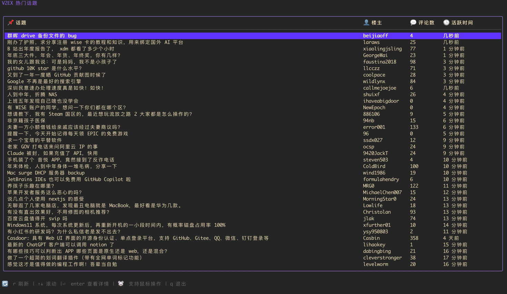
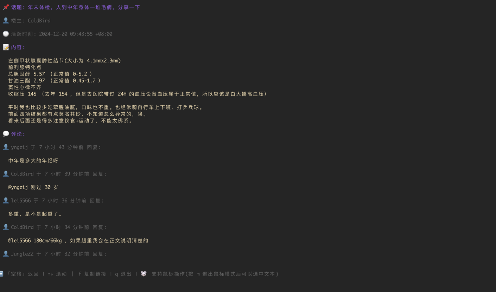

# V2EX TUI 🎩✨

欢迎来到 **V2EX TUI** 

用命令行潜入 V2EX 世界，就像90年代电影中的黑客😎

不想上班？不想干活？摸鱼看 V2EX 担心被老板发现？那你可以试试 V2EX TUI 😁

## 🌟 功能介绍

- **浏览热门话题**: 

- **查看话题详情**: 

## 🛠️ 特点介绍

- **隐蔽**: 在终端里浏览 V2EX，老板以为你在写代码呢！🤫
- **支持鼠标操作**: 在命令行就只能用键盘了吗？没有鼠标怎么刷的爽？🖱️

## 🚀 使用教程

### 如何启动

1. 克隆这个仓库 or [下载该程序](https://github.com/kaolengmian7/v2ex-tui/releases)
2. `cd path/to/v2ex-tui/bin`
3. 运行 `./v2ex-tui`
4. 如果你有 golang 环境，也可以找到 main 文件运行 `go run main.go`

### 命令介绍

- `↑` / `↓`: 滚动浏览话题或评论
- `enter`: 查看话题详情
- `backspace` / `空格`: 返回上一级
- `m`: 切换鼠标支持模式
- `f`: 复制当前话题链接到剪贴板
- `q` / `ctrl+c`: 退出程序

## ⭐ Star

这是我的第一个开源产品，还不知道拿到 ⭐ 是啥感觉，求安排！

## 问题排查
1. 如果命令行窗口太小，可能会导致 UI 问题。(我已经尽量实现自动适配窗口大小了😂)
2. 如果获取 V2EX 帖子，比如 time out，可能是网络问题，建议检查 VPN，可以尝试开启 clashx 的 tun 模式。

## 🚫 目前还不支持的功能

- **发表评论**: 
- **多级评论**: 目前只支持查看一级评论，更多层级的评论还在开发中。
- **分页查看主题和评论**
